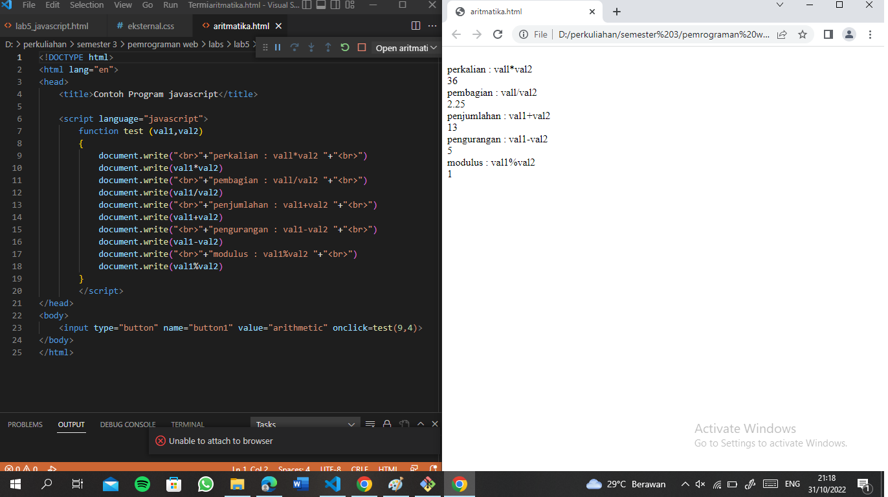

# lab5web
nama : Raihan syahwal

NIM:312110362

KELAS:TI.21.B.1

## PRAKTIKUM
cara memanggil java 

button

seleksi kondidsi

switch

checkbox

aritmatika

### tugas praktek 
membuat sebuah form validasi

jika nama tidak di isi maka 

dan seterusnya seperti itu , jika ada yg tidak di isi maka akan memberikan notifikasi error pada bagian atas 